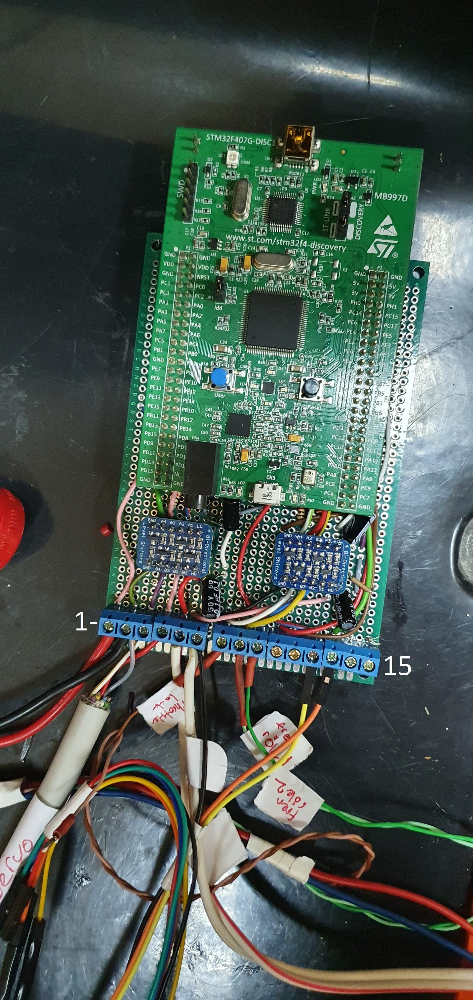

# Custom Board Pinout

#### 			 Using for|PIN

### 1-) Throttle Volt  ------------------------------ A5

### 2-) GND

### 3-) Direction  ----------------------------------- E14 

### 4-) PWM  ----------------------------------------- B10 

### 5-) 5V  --------------------------------------------- Input

### 6-) GND

### 7-) Throttle Lock  -----------------------------  E6 	

### 8-) Brake Röle1  ------------------------------- B8 

### 9-) Brake Röle2  ------------------------------- D7

### 10-) Start button(Interrupt)  ------------ E5 

### 11-) Emergency button(Interrupt) --- B7 

### 12-) UART Tx  ----------------------------------- D5 

### 13-) UART Rx  ----------------------------------- D6 

### 14-) NC -------------------------------------------- A3

### 15-) 3V (out)

